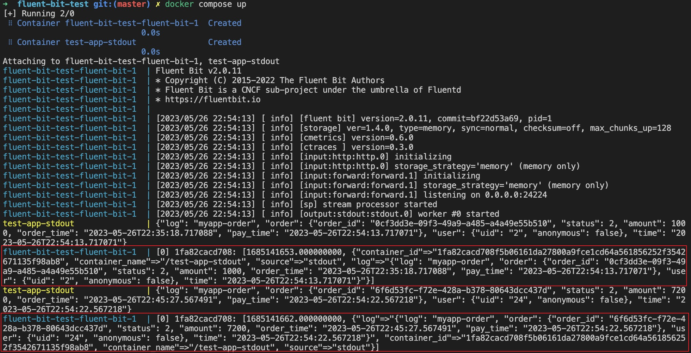
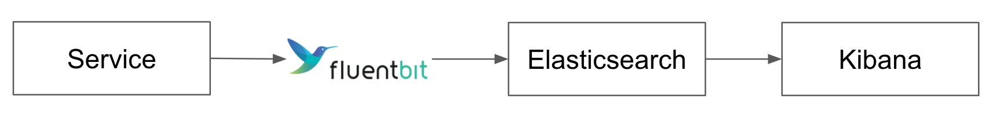
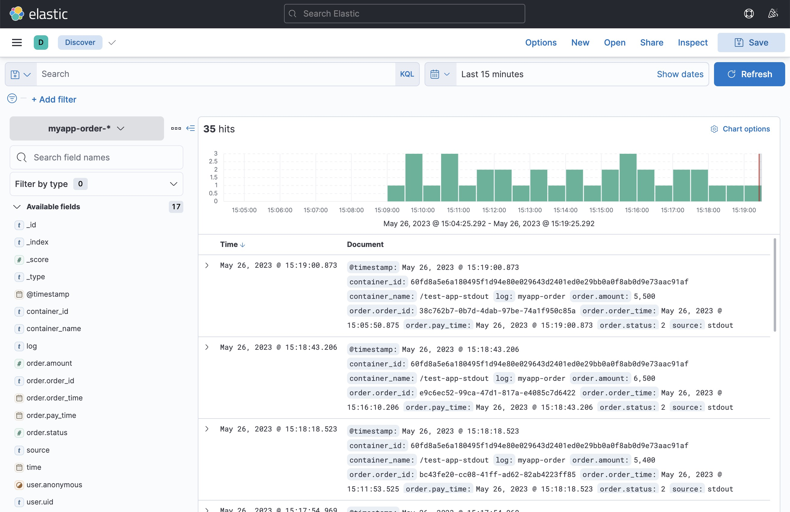
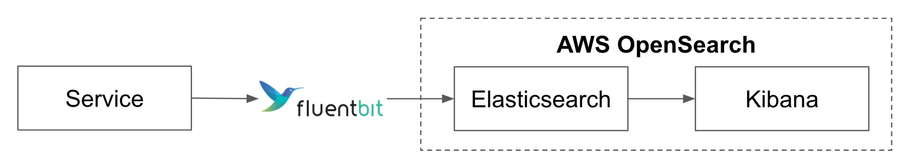
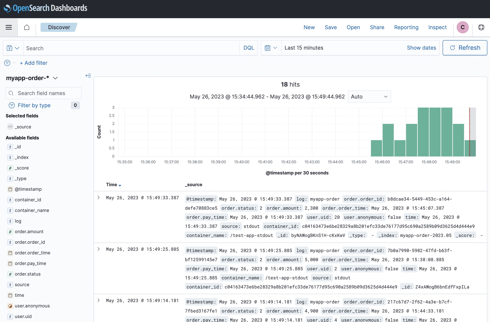
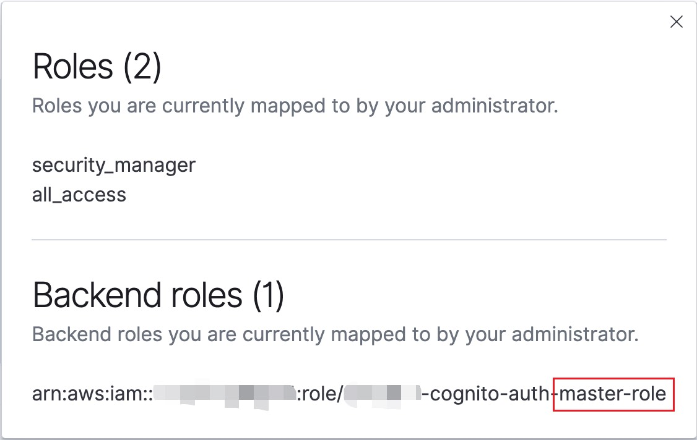
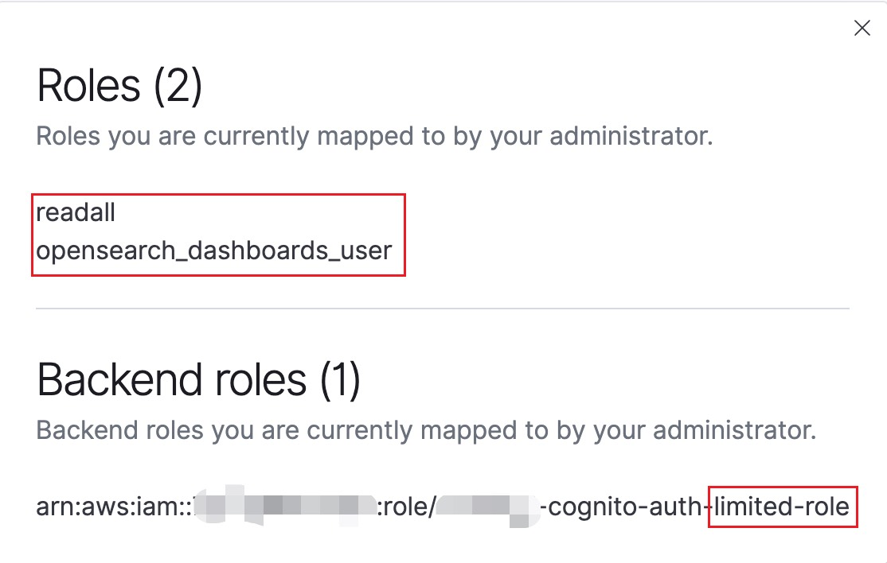

# Logging System Demo

## Overview
This demo is to show how to implement a logging system.
- **Demo1**: Fluent Bit simply collects loggings and output to **stdout**
- **Demo2**: Fluent Bit collects loggings and output to **Elasticsearch and Kibana**
- **Demo3**: Fluent Bit collects loggings and output to **AWS OpenSearch**
- **Trace Analytics**: traces demo and append `trace-id` and `span-id` to loggings by **OpenTelemetry**.
- **Frontend Logging**: Demo showing the logging process **Frontend -> Nginx -> Fluent Bit**

## Demo1 (stdout)
- `test-app-stdout` prints log on `docker logs`
- `fluent-bit` collects logs and prints on `stdout`


### Run on Docker
```sh
# Deploy container (Ctrl-C to exit)
docker compose up

# Test for frontend log
curl -d '{"log_name": "myapp-click","click_text": "action.goBack","uid": "1", "time": "2023-04-07T06:58:28.123456"}' -XPOST -H "content-type: application/json" http://localhost:9880/frontendTag
```

### Result


### Destroy
```sh
# Delete all containers and relevant images
docker compose down --rmi all
```

## Demo2 (elasticsearch)
- `test-app-stdout` prints log on `docker logs`
- `fluent-bit` collects logs and sends to `elasticsearch`



### Run on Docker

```sh
# Deploy container (Ctrl-C to exit)
docker compose -f docker-compose-es.yaml up

# Test for frontend log
curl -d '{"log_name": "myapp-click","click_text": "action.goBack","uid": "1", "time": "2023-04-07T06:58:28.123456"}' -XPOST -H "content-type: application/json" http://localhost:9880/frontendTag
```

### Create Index Patterns
```sh
# pattern: 'myapp-order-*'
curl -X POST "localhost:5601/api/index_patterns/index_pattern" -H 'kbn-xsrf: true' -H 'Content-Type: application/json' -d'
{
  "index_pattern": {
     "title": "myapp-order-*",
     "timeFieldName": "@timestamp"
  }
}
'

# pattern: 'myapp-login-*'
curl -X POST "localhost:5601/api/index_patterns/index_pattern" -H 'kbn-xsrf: true' -H 'Content-Type: application/json' -d'
{
  "index_pattern": {
     "title": "myapp-login-*",
     "timeFieldName": "@timestamp"
  }
}
'

# pattern: 'myapp-click-*'
curl -X POST "localhost:5601/api/index_patterns/index_pattern" -H 'kbn-xsrf: true' -H 'Content-Type: application/json' -d'
{
  "index_pattern": {
     "title": "myapp-click-*",
     "timeFieldName": "@timestamp"
  }
}
'
```

### Discover Data
- Visit `Kibana` to see data: [http://localhost:5601/app/discover#/](http://localhost:5601/)




### Destroy
```sh
# Delete all containers and relevant images
docker compose -f docker-compose-es.yaml down --rmi all
```


## Demo 3 (AWS OpenSearch)
- `test-app-stdout` prints log on `docker logs`
- `fluent-bit` collects logs and sends to `AWS OpenSearch`



### Terraform

#### Init
```sh
# Terraform (AWS OpenSearch)
cd tf
cp terraform.tfvars.example terraform.tfvars
terraform init
```

#### Apply

- Manually configure `terraform.tfvars`:
  - AWS `access_key`
  - AWS `secret_key`
  - `cognito_master_email`: As a default master user, with full access permission in OpenSearch.
  - `cognito_limited_email`: As a default limited user, with only dashboard and readall permission in OpenSearch.
    - **You will receive password via email.**
    - Use email and password to login `OpenSearch Dashboard` when instance is ready.

```sh
# If there is an error related to service_linked_role, just comment all "aws_iam_service_linked_role" in `tf/main.tf`.
# Note: It takes about 30 minutes to complete
terraform apply -auto-approve
# Config for fluent-bit (only for demo)
terraform output > tf_output.log
cd ..
```
**Note**
- If you face an error `Domain already associated with another user pool`, which means someone has already used this cognito custom domain as his authentication domain. This domain needs to be **globally unique**, as the pattern is `https://{domain}.auth.{region}.amazoncognito.com`.
- To address this issues, either one of options is available:
  - **Set another OpenSearch domain**: Modify your domain in `terraform.tfvars` to use another domain name. (in our terraform, cognito custom domain is the same as your OpenSearch domain)
  - **Set another user pool domain**: Modify `cognito.tf` -> resource `aws_cognito_user_pool_domain` -> `name`.

### Docker
```sh
# Deploy container (Ctrl-C to exit)
docker compose -f docker-compose-aws.yaml --env-file ./tf/tf_output.log up

# Test for frontend log
curl -d '{"log_name": "myapp-click","click_text": "action.goBack","uid": "1", "time": "2023-04-07T06:58:28.123456"}' -XPOST -H "content-type: application/json" http://localhost:9880/frontendTag
```

### Discover Data

1. Go to AWS OpenSearch Dashboard (two options).
   - URL
     - `cat ./tf/tf_output.log`
     - check `AWS_OPENSEARCH_DASHBOARD` value, visit as a url (with `https://` prefix)
   - AWS Console
     - AWS `OpenSearch` -> `YOUR_OPENSEARCH_DOMAIN_NAME` -> `OpenSearch Dashboards URL`
2. Login with either `master` or `limited` email and password (password is sent to the email).
4. Go to `Discover` to view the results.

- New cognito user **without** a user group has no permissions to enter the dashboard.




### Check Permissions

#### Master User
1. Go to AWS OpenSearch Dashboard (See [Discover Data](#discover-data-1)).
2. Login with **master** email and password (password is sent to the email).
3. Check out permissions (upper-right icon -> `View roles and identities`).



#### Limited User
1. Go to AWS OpenSearch Dashboard (See [Discover Data](#discover-data-1)).
2. Login with **limited** email and password (password is sent to the email).
3. Check out permissions (upper-right icon -> `View roles and identities`).



### Destroy
```sh
# Delete all containers and relevant images
docker compose -f docker-compose-aws.yaml --env-file ./tf/tf_output.log down --rmi all
# Delete AWS resources
## Note: It takes about 30 minutes to complete
cd tf
terraform destroy -auto-approve
```

## Trace Analytics
See [trace-analytics](./trace-analytics/)

## Frontend Logging
See [frontend-logging](./frontend-logging/)
