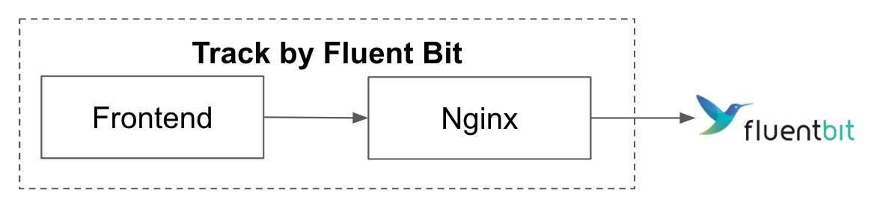
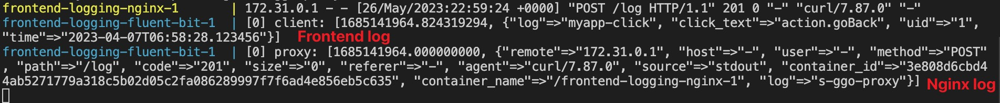

# Frontend Logging Demo

## Overview
This demo shows how to track frontend/Nginx logs via Fluent Bit.

## Process
- Frontend sends a log to nginx endpoint
- Nginx forwards request to Fluent Bit
- Fluent Bit receives and parses both the frontend logs and Nginx logs, output to `stdout`



## Run on Docker

```sh
# Deploy container (Ctrl-C to exit)
docker compose up

# Trigger frontend log
curl -d '{"log_name": "myapp-click","click_text": "action.goBack","uid": "1", "time": "2023-04-07T06:58:28.123456"}' -XPOST -H "content-type: application/json" -H "origin: www.myapp.com" http://localhost/log

# Fail due to CORS rule (`origin` is missing)
curl -d '{"log_name": "myapp-click","click_text": "action.goBack","uid": "1", "time": "2023-04-07T06:58:28.123456"}' -XPOST -H "content-type: application/json" http://localhost/log
```

## Result



## Destroy
```sh
# Delete all container and relevant images
docker compose down --rmi all
```