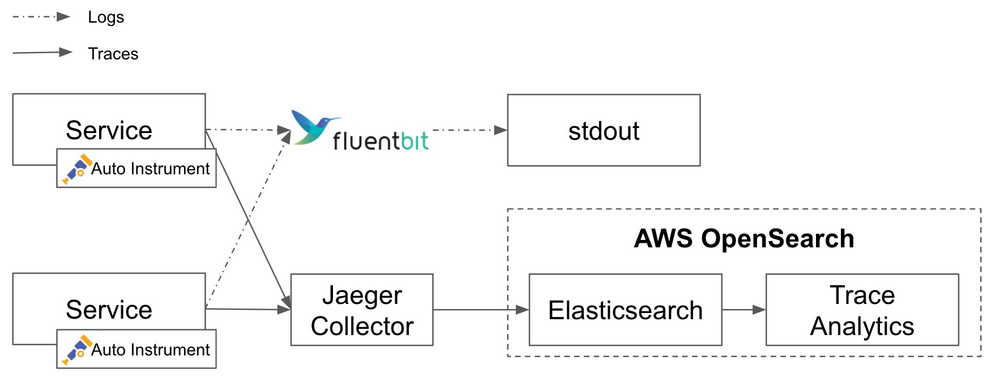
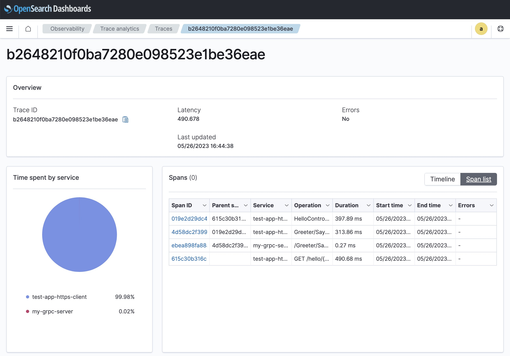
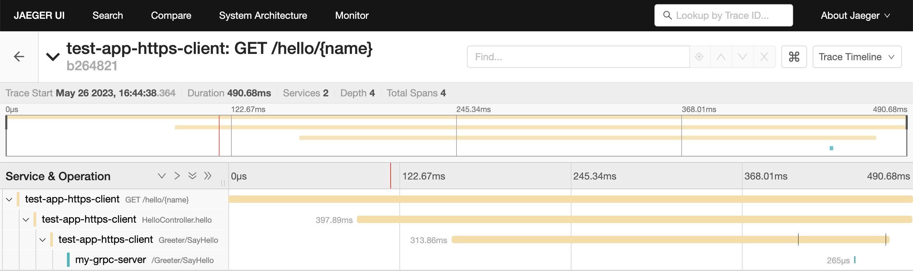

# AWS OpenSearch Trace Analytics Demo

## Overview
This demo is to use OpenTelemetry for trace analytics.
- Features
  - **Trace** for a series of API calling, including `trace-id` and `span-id`
  - **Logs** data will be appended with `trace-id` and `span-id`

- Primary components:
  - `fluent-bit` collects logs and output to `stdout` directly
  - `test-app-https-client` is a Java Spring Boot web application.
  - `test-app-grpc-server` is a GRPC server written in Python.
  - `tf` is a terraform module to create a AWS OpenSearch resource

## Process
- When visiting an url to trigger `test-app-https-client` and `test-app-grpc-server` .
- Apps trace
  - instrumented by OpenTelemetry auto-instrumentation
  - collected by Jaeger Collector
  - send to OpenSearch
- Apps logs
  - instrumented by OpenTelemetry auto-instrumentation, adding `trace-id`, `span-id`
  - print to console
  - console logging is collected by Fluent-Bit
  - Fluent-Bit output logs on stdout

**Note**: Fluent-Bit outputs to stdout is because `Jaeger` can only access elasticsearch with username/password,
so we create our OpenSearch with username/password which is not supported by Fluent-Bit as far as we tried.
In production, we should use `master_arn` to create AWS OpenSearch, and host `Jaeger` on AWS EC2 so that it has the permission to access OpenSearch.



## Run

### Terraform
#### Init
```sh
# Terraform (AWS OpenSearch)
cd tf
cp terraform.tfvars.example terraform.tfvars
terraform init
```

#### Apply

- Manually configure `terraform.tfvars`:
  - AWS `access_key`
  - AWS `secret_key`

```sh
# If there is an error related to service_linked_role, just comment all "aws_iam_service_linked_role" in `tf/main.tf`.
# Note: It takes about 30 minutes to complete
terraform apply -auto-approve
# Config for fluent-bit (only for demo)
terraform output > tf_output.log
cd ..
```

### Docker
```shell
# Deploy container (Ctrl-C to exit)
docker compose --env-file ./tf/tf_output.log up
```

### Visit and Result
- Trigger apps by visiting [http://localhost:8080/hello/test](http://localhost:8080/hello/test)
- Go to AWS OpenSearch Dashboard
  - URL
    - `cat ./tf/tf_output.log`
    - check `AWS_OPENSEARCH_DASHBOARD` value, visit as a url (with `https://` prefix)
  - Login
    - `username`: admin
    - `password`: Admin_123
  - Trace Analytics
    - left-side menu -> `Observability` -> `Trace Analytics` -> `Traces`. You should see the trace data.
- If you think OpenSearch Dashboard is not ideal, you can try Jaeger UI on [http://localhost:16686/](http://localhost:16686/)

#### OpenSearch


#### Jaeger


### Destroy
```shell
# Delete all container and relevant images
docker compose --env-file ./tf/tf_output.log down --rmi all
# Delete AWS resources
## Note: It takes about 30 minutes to complete
cd tf
terraform destroy -auto-approve
```

## Run on Local Machine
- In previous section, applications are running on docker.
- If you want to run on your local machine instead of docker, or you want to custom code and run it on docker again, please follow the instructions below.

### Java HTTP Client
```shell
cd test-app-https-client
# Only for grpc protos
# mkdir src/main/proto
# cp -R ../proto src/main/
mvn -DGRPC_SERVER=test-app-grpc-server:50051 package
java \
  -javaagent:opentelemetry-javaagent.jar \
  -Dotel.service.name=test-app-https-client \
  -Dotel.traces.exporter=otlp \
  -Dotel.metrics.exporter=none \
  -Dio.opentelemetry.javaagent.slf4j.simpleLogger.defaultLogLevel=off \
  -DGRPC_SERVER=localhost:50051 \
  -jar target/test-app-https-client-0.0.1-SNAPSHOT.jar
```
- Note: To successfully collect trace data, you still need to launch docker, but comment the `test-app-https-client` part.

### Python GRPC Server
```shell
cd test-app-grpc-server
python -m venv venv
source venv/bin/activate
pip install -r requirements.txt
# Only for grpc protos
# python -m grpc_tools.protoc -I../proto --python_out=. --pyi_out=. --grpc_python_out=. ../proto/hello.proto
opentelemetry-instrument \
    --traces_exporter otlp \
    --metrics_exporter none \
    --service_name my-grpc-server \
    python my-grpc-server.py

deactivate  # exit venv
```
- Note1: To successfully collect trace data, you still need to launch docker, but comment the `test-app-grpc-server` part.
- **Note2: logs is not working on local machine when using Python.**
